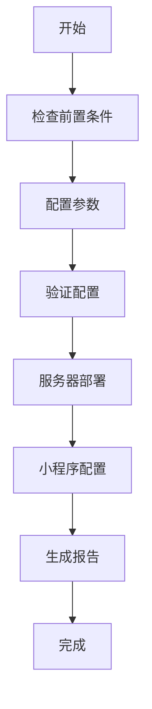

# 八字运势小程序 - 自动化部署系统

## 🚀 快速开始

### 一键部署（推荐）

```bash
cd bazi-miniprogram/deployment
bash one_click_deploy.sh
```

这个脚本会引导你完成整个部署过程，包括服务器部署和小程序配置。

### 分步部署

如果你需要更精细的控制，可以分步执行：

#### 1. 服务器部署
```bash
# 1. 配置服务器参数
vim deploy_config.sh

# 2. 执行自动部署
bash auto_deploy.sh
```

#### 2. 小程序发布
```bash
# 1. 配置小程序参数
vim miniprogram_config.js

# 2. 准备发布包
node prepare_miniprogram.js production
```

## 📁 文件说明

### 核心配置文件

| 文件 | 说明 | 是否必须修改 |
|------|------|-------------|
| `deploy_config.sh` | 服务器部署配置 | ✅ 必须 |
| `miniprogram_config.js` | 小程序发布配置 | ✅ 必须 |

### 核心脚本文件

| 文件 | 说明 | 使用场景 |
|------|------|---------|
| `one_click_deploy.sh` | 一键部署脚本 | 🎯 首次部署推荐 |
| `auto_deploy.sh` | 服务器自动部署 | 🔧 仅服务器部署 |
| `prepare_miniprogram.js` | 小程序发布准备 | 📱 仅小程序发布 |

### 文档文件

| 文件 | 说明 |
|------|------|
| `DEPLOYMENT_COMPLETE_GUIDE.md` | 完整部署指南 |
| `README.md` | 本文件 |

## ⚙️ 配置说明

### 服务器配置 (`deploy_config.sh`)

```bash
# 【必填】基本信息
export SERVER_IP="123.456.789.0"              # 服务器IP
export DOMAIN_NAME="example.com"               # 主域名
export API_SUBDOMAIN="api.example.com"        # API子域名
export SSL_EMAIL="your-email@example.com"     # SSL证书邮箱

# 【可选】高级配置
export SERVICE_PORT="8001"                    # API端口
export ENABLE_SSL="yes"                       # 启用SSL
export ENABLE_MONITORING="yes"                # 启用监控
```

### 小程序配置 (`miniprogram_config.js`)

```javascript
module.exports = {
  // 【必填】基本信息
  appId: 'wx1234567890abcdef',                 // 小程序AppID
  version: '1.0.0',                           // 版本号
  
  // 【必填】服务器配置
  production: {
    apiDomain: 'https://api.example.com',      // 生产环境API
  },
  
  // 【必填】微信信息
  wechat: {
    account: 'your-wechat@example.com',        // 微信账号
  }
}
```

## 🎯 部署流程

### 完整部署流程



### 服务器部署详细步骤

1. **系统更新** - 更新Ubuntu系统包
2. **依赖安装** - 安装Python、Nginx等
3. **用户创建** - 创建应用用户和目录
4. **代码克隆** - 从GitHub克隆最新代码
5. **环境配置** - 配置Python虚拟环境
6. **服务创建** - 创建systemd服务
7. **Nginx配置** - 配置反向代理
8. **SSL证书** - 申请Let's Encrypt证书
9. **服务启动** - 启动所有服务
10. **验证测试** - 验证部署结果

### 小程序发布详细步骤

1. **配置验证** - 验证配置文件正确性
2. **环境切换** - 切换到生产环境API
3. **代码清理** - 移除开发代码和日志
4. **资源优化** - 压缩图片和资源文件
5. **版本生成** - 生成版本信息文件
6. **连接测试** - 测试API连接状态
7. **指南生成** - 生成详细发布指南

## 🔧 运维管理

### 服务器管理命令

```bash
# 查看API服务状态
systemctl status bazi-api

# 重启API服务
systemctl restart bazi-api

# 查看服务日志
journalctl -u bazi-api -f

# 查看Nginx状态
systemctl status nginx

# 重载Nginx配置
systemctl reload nginx

# 查看访问日志
tail -f /var/log/nginx/api.yourdomain.com_access.log
```

### SSL证书管理

```bash
# 检查证书状态
certbot certificates

# 手动续期证书
certbot renew

# 测试自动续期
certbot renew --dry-run
```

### 小程序版本管理

```bash
# 准备生产环境版本
node prepare_miniprogram.js production

# 准备开发环境版本
node prepare_miniprogram.js development

# 验证配置
node miniprogram_config.js
```

## 🛠️ 故障排除

### 常见问题

#### 1. 配置验证失败
**问题**: 运行脚本时提示配置错误
**解决**: 检查配置文件中的必填项是否正确填写

#### 2. SSH连接失败
**问题**: 无法连接到服务器
**解决**: 
- 检查服务器IP是否正确
- 确认SSH服务正在运行
- 验证防火墙设置

#### 3. 域名解析问题
**问题**: API无法通过域名访问
**解决**: 
- 配置DNS A记录指向服务器IP
- 等待DNS解析生效（通常需要几分钟）

#### 4. SSL证书申请失败
**问题**: Let's Encrypt证书申请失败
**解决**: 
- 确保域名已正确解析到服务器
- 检查防火墙是否开放80端口
- 验证邮箱地址格式正确

#### 5. 小程序网络请求失败
**问题**: 小程序提示网络错误
**解决**: 
- 在微信公众平台配置服务器域名
- 确保API服务正常运行
- 检查HTTPS证书有效性

### 日志查看

```bash
# 部署日志
cat deployment/deploy_*.log

# API服务日志
journalctl -u bazi-api --since "1 hour ago"

# Nginx错误日志
tail -f /var/log/nginx/error.log

# 系统日志
tail -f /var/log/syslog
```

## 📚 参考资料

### 官方文档
- [微信小程序开发文档](https://developers.weixin.qq.com/miniprogram/dev/)
- [阿里云ECS使用指南](https://help.aliyun.com/product/25365.html)
- [Let's Encrypt证书申请](https://letsencrypt.org/)

### 相关技术
- **FastAPI**: Python Web框架
- **Nginx**: 反向代理服务器
- **systemd**: Linux系统服务管理
- **Ubuntu**: 服务器操作系统

## 🎉 最佳实践

### 安全建议
1. **定期更新** - 及时更新系统和依赖包
2. **备份数据** - 定期备份重要配置和数据
3. **监控服务** - 设置服务监控和告警
4. **防火墙配置** - 只开放必要的端口

### 性能优化
1. **缓存配置** - 启用Nginx静态文件缓存
2. **压缩传输** - 启用gzip压缩
3. **CDN加速** - 使用CDN加速静态资源
4. **数据库优化** - 如使用数据库，注意索引优化

### 运维自动化
1. **监控告警** - 配置服务状态监控
2. **自动备份** - 设置定时备份任务
3. **日志轮转** - 配置日志文件轮转
4. **更新策略** - 制定安全更新策略

## 📞 获取帮助

### 技术支持
- **项目文档**: 查看项目README和相关文档
- **GitHub Issues**: 在项目仓库创建Issue
- **社区讨论**: 参与项目讨论区

### 紧急联系
- 对于生产环境的紧急问题，请及时查看错误日志
- 可以通过重启服务来快速恢复
- 保持配置文件的备份以便快速回滚

---

**版本**: v1.0  
**更新时间**: 2025年9月25日  
**维护者**: 八字运势开发团队

🚀 **开始你的部署之旅吧！运行 `bash one_click_deploy.sh` 即可开始！**
