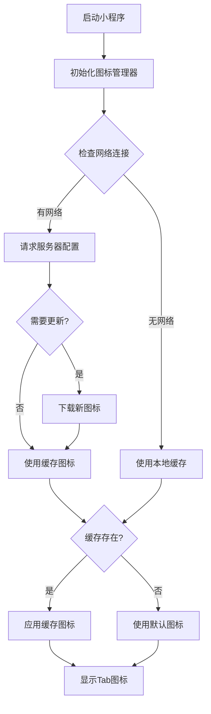

# 离线Tab图标功能使用指南

本文档介绍了微信小程序中离线Tab图标功能的使用方法和原理。

## 🎯 功能概述

离线Tab图标功能为八字小程序提供了网络不可用时的图标备用方案，确保用户界面的完整性和一致性。

### 主要特性

- 🔌 **离线支持**: 网络不可用时自动使用本地默认图标
- 🎨 **多重降级**: 动态下载 → 本地缓存 → 默认图标的三级降级机制  
- 📱 **无缝切换**: 用户无感知的图标切换体验
- 🛡️ **错误容错**: 完善的错误处理和回退机制

## 📁 文件结构

```
miniprogram/
├── images/
│   └── tab-icons/              # 默认图标目录
│       ├── bazi_normal.png     # 八字测算-普通状态
│       ├── bazi_selected.png   # 八字测算-选中状态
│       ├── festival_normal.png # 节日列表-普通状态
│       ├── festival_selected.png # 节日列表-选中状态
│       ├── zodiac_normal.png   # 生肖配对-普通状态
│       ├── zodiac_selected.png # 生肖配对-选中状态
│       ├── profile_normal.png  # 个人中心-普通状态
│       ├── profile_selected.png # 个人中心-选中状态
│       └── config.json         # 图标配置文件
└── utils/
    └── icon-manager.js         # 图标管理器(已更新)

scripts/
└── generate_default_icons.py  # 图标生成脚本
```

## 🚀 使用方法

### 1. 生成默认图标

首次使用前，需要生成默认图标文件：

```bash
cd bazi-miniprogram

# 激活虚拟环境
source venv/bin/activate

# 生成默认图标
python scripts/generate_default_icons.py

# 查看生成的文件
python scripts/generate_default_icons.py list
```

### 2. 小程序集成

图标管理器已经集成到现有的系统中，无需额外配置。在 `app.js` 中的初始化代码会自动处理离线图标：

```javascript
// app.js 中已有的代码
const { iconManager } = require('./utils/icon-manager.js')

App({
  async onLaunch() {
    // 初始化图标系统（已包含离线支持）
    await iconManager.init()
  }
})
```

## 💡 工作原理

### 图标加载流程



### 降级策略

1. **首选**: 动态下载的主题图标
2. **备选**: 本地缓存的图标文件
3. **兜底**: 项目内置的默认图标

## 🔧 维护管理

### 重新生成图标

当需要更新默认图标样式时：

```bash
# 清理旧图标
python scripts/generate_default_icons.py clean

# 生成新图标
python scripts/generate_default_icons.py
```

### 自定义图标

如需自定义默认图标，可以修改 `backend/app/icon_generator.py` 中的图标生成逻辑，然后重新生成。

### 测试功能

运行离线功能测试：

```bash
cd bazi-miniprogram
node tests/test_offline_icons.js
```

## 📊 图标规格

| 属性 | 值 |
|------|------|
| 尺寸 | 40x40 像素 |
| 格式 | PNG |
| 透明背景 | 支持 |
| 颜色模式 | RGBA |

### 默认主题配色

| 状态 | 颜色值 | 描述 |
|------|--------|------|
| normal | #666666 | 普通状态灰色 |
| selected | #C8860D | 选中状态金色 |

## 🎨 图标设计

### 图标类型

1. **八字测算** (bazi): 太极八卦图案
2. **节日列表** (festival): 日历图案  
3. **生肖配对** (zodiac): 心形图案
4. **个人中心** (profile): 用户图案

### 设计原则

- 简洁明了，符合小程序设计规范
- 在小尺寸下仍然清晰可辨
- 普通和选中状态有明显区别
- 与整体UI风格保持一致

## 🛠️ 故障排除

### 常见问题

**Q: 图标不显示**
A: 检查 `miniprogram/images/tab-icons/` 目录是否存在图标文件

**Q: 只显示文字没有图标**  
A: 运行图标生成脚本重新创建默认图标

**Q: 图标显示异常**
A: 检查图标文件是否损坏，重新生成即可

### 调试信息

在开发者工具中查看控制台日志，图标管理器会输出详细的加载过程：

```
[IconManager] 开始初始化图标管理器
[IconManager] 没有缓存图标，使用默认图标  
[IconManager] Tab 0 (bazi) 默认图标应用成功
[IconManager] 图标应用完成: 4/4 个tab使用默认图标
```

## 📈 性能优化

### 文件大小

默认图标文件都经过优化，单个文件大小约200-500字节，8个图标文件总大小不超过4KB。

### 加载性能

- 默认图标随小程序包一起加载，无网络请求延迟
- 支持渐进式加载：先显示默认图标，后台下载更新

## 🔄 版本更新

当有新的图标版本时：

1. 更新 `icon_generator.py` 中的图标生成逻辑
2. 重新运行生成脚本
3. 测试新图标显示效果
4. 发布小程序更新

---

通过这个离线Tab图标功能，八字小程序现在可以在任何网络环境下都能提供完整的用户界面体验！

## 📞 技术支持

如有问题请查看：
- [项目主文档](../README_TAB_ICONS.md)
- [技术实现指南](./tab-icon-configuration-guide.md)
- [开发环境设置](./development-setup.md)
